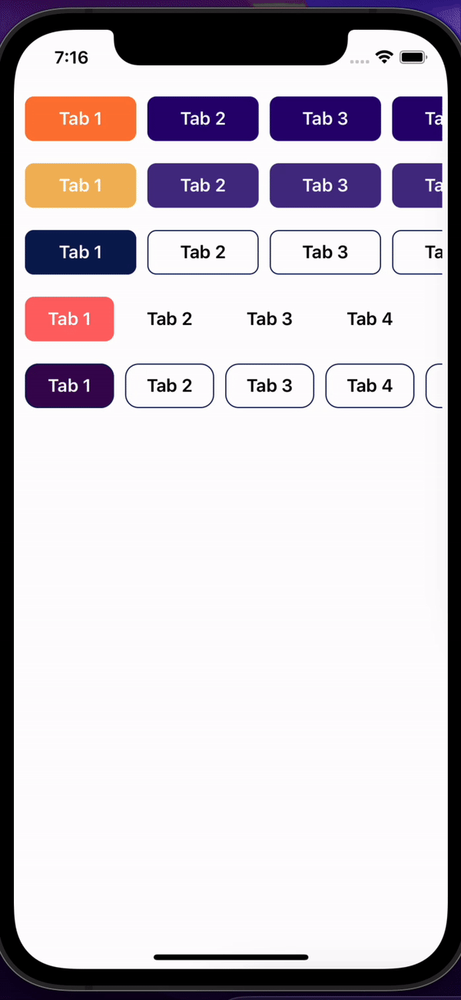
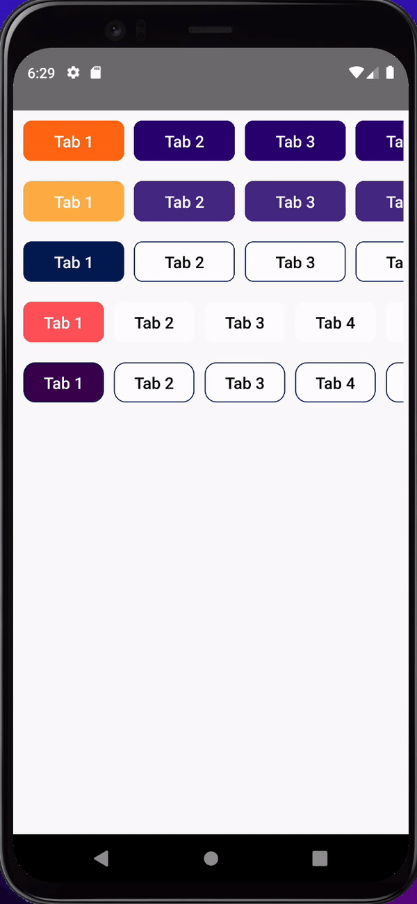

# RNSwitch

| iOS                            | Android                                 |
| ------------------------------ | --------------------------------------- |
|  |  |

#### RNSwitch is a customizable React Native component designed to implement a horizontal switch with multiple tabs. It allows users to scroll through tabs and select their desired option. The component provides flexibility in terms of styling and customization to seamlessly integrate with your React Native applications.

## Installation

```
npm install rns-switch
```

## Usage

```
import React from 'react';
import { View } from 'react-native';
import RNSwitch from 'rns-switch';

const YourComponent = () => {
  const options = [
    { key: '1', value: 'Tab 1' },
    { key: '2', value: 'Tab 2' },
    // Add more tabs as needed
  ];

  const handleTabPress = (selectedTab) => {
    // Your custom logic when a tab is pressed
    console.log('Selected Tab:', selectedTab);
  };

  return (
    <View>
      <RNSwitch
        option={options}
        onPress={handleTabPress}
        selectedColor="#2E5894"
        unSelectedColor="#0A1D56"
        selectedTextColor="#fff"
        unSelectedTextColor="#A9A9A9"
      />
      {/* Your other components or views */}
    </View>
  );
};

export default YourComponent;

```

## Props

- option (Array, required): An array of objects representing each tab. Each object should have a key and value property.

- onPress (Function, required): Callback function invoked when a tab is pressed. It receives the selected tab as an argument.

- selectedColor (String): Background color of the selected tab.

- unSelectedColor (String): Background color of the unselected tabs.

- selectedTextColor (String): Text color of the selected tab.

- unSelectedTextColor (String): Text color of the unselected tabs.

- containerStyle (Object): Additional styles for the tab container.

- textStyle (Object): Additional styles for the text inside each tab.

## Example

> For a complete example, refer to the usage section above.

### Styling

#### Customize the appearance of the tabs by providing styles through the selectedColor, unSelectedColor, selectedTextColor, unSelectedTextColor, containerStyle, and textStyle props.

```
<RNSwitch
  option={options}
  onPress={handleTabPress}
  selectedColor="#2E5894"
  unSelectedColor="#0A1D56"
  selectedTextColor="#fff"
  unSelectedTextColor="#A9A9A9"
  containerStyle={{ borderRadius: 10 }}
  textStyle={{ fontSize: 18 }}
/>

```

#### Feel free to adjust the values according to your application's design.
